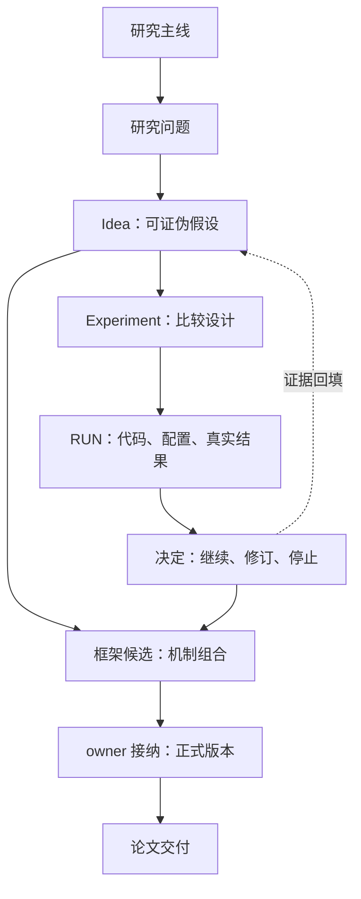

# GZSL 论文研究

> 唯一当前入口 · 2026-09-06 按 owner 确认的长期管理方式整理。历史正式版本不自动成为新研究的代码起点。

## 现在做什么

| 项目 | 当前事实 |
|---|---|
| 主线 | `triadic-native`：研究全新的原生三分支 GZSL 框架 |
| 阶段 | 研究问题与机制探索；尚未形成正式新方法 |
| 已确定 | 三支对等、各有不可替代的类别证据、最终 logits 前通信、同次前向与反向协同优化 |
| 未确定 | 第三分支、通信机制、公式、准确代码起点和实验条件 |
| 当前主攻 Idea | 尚未指定；不从最大编号或最近分支推定 |
| 当前 RUN | 未绑定本主线的正式 RUN；本次整理未检查服务器实时作业 |
| 下一步 | 明确三支各自提供的证据与最小可证伪机制，再由 owner 指定准确代码起点 |
| 旧原型 | 已有 V8 命名仅为探索身份，不代表正式 V8；smoke 不等于正式实验 |

## 五个入口

| 要找什么 | 入口 | 事实归属 |
|---|---|---|
| 研究全貌、当前问题 | [Idea 树](research/IDEA_TREE.md) | 关系与导航 |
| Idea 怎么保存和复用 | [研究记录规范](research/README.md) | 假设、演化与证据边界 |
| 实验在哪里、准确代码是什么 | [跨分支总账](research/LEDGER_INDEX.md) | 记录位置；数字以原 RUN 为准 |
| 怎样开始一次实验 | [实验规范](docs/EXPERIMENT_PROTOCOL.md) | 代码起点、比较条件与 RUN 合同 |
| 历史版本与研究资产 | [实验索引](experiments/INDEX.md) | 历史入口；不默认激活旧任务 |

## 存储与代码

- Idea 跨框架共用，卡片留在 `research/ideas/`；索引不复制公式和成绩。
- 历史 `experiments/vX/` 原地只读保留；新主线首次真实登记时使用 `experiments/<track_id>/`，不预建空框架版本。
- 新代码必须记录 `research_mode`、`base_commit`、`reuse_scope`、`change_scope`、`comparison_ref` 和唯一研究问题。代码起点与比较基线分开。
- `main` 保存正式代码与已核实轻量记录；候选代码留在实验分支。Git 保存代码和配置，仓库外保存数据、缓存、模型和大日志。
- `framework/vX` 与 `vX` 固定在同一 commit；旧正式框架依然有效，但不自动代表当前方向。
- `论文框架仓库/` 仅在 owner 明确要求交付快照时更新。

当前任务只做记录整理，没有接纳新 Idea、选择代码父条件、启动训练或发布论文。
